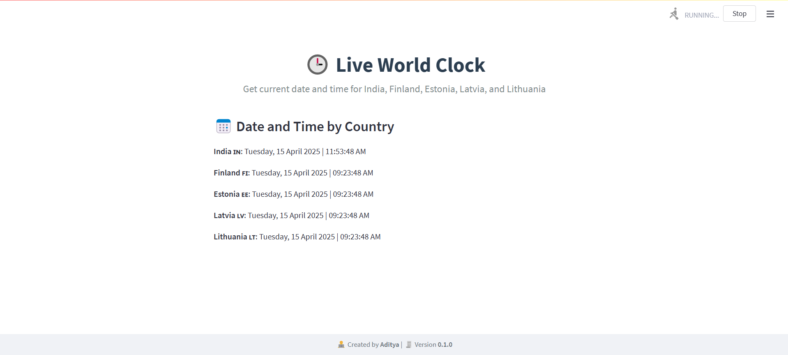

# ChronoGlobe-World-Watch

You can view the live application by visiting the link below:

👉 [Live ChronoGlobe World Watch App](https://chronoglobe-world-watch-aditya.streamlit.app/)

ChronoGlobe is a simple and easy-to-use web app that shows the live date and time for India, Finland, Estonia, Latvia, and Lithuania.

This project was built using **Streamlit**, an open-source Python library that makes it incredibly easy to create web applications, especially for data scientists and Python developers.

With **Streamlit**, you don’t need any knowledge of **HTML**, **CSS**, or **JavaScript** to build and deploy interactive interfaces. Just write Python code, and Streamlit takes care of the rest.

---

### 💡 Why This App?

The core idea behind this application is simple:

> _To save time and reduce the hassle of manually calculating time differences between countries, especially during daylight saving changes._

As a developer working with global clients, it becomes tricky to keep track of time zone shifts (especially in European regions). This tool provides a **live view of date and time** across multiple countries like **India, Finland, Estonia, Latvia, and Lithuania**  all in one clean and responsive dashboard.

---

### 🔧 Tech Stack

- **Python 3.x**
- **Streamlit** (for frontend and backend combined)
- **pytz** & `datetime` (for timezone management)

---

### 🧠 Who is this for?

- Data scientists and backend developers
- Anyone who wants to build web apps without diving into frontend code
- People who work with international teams or clients

---

> ✅ This app proves that even with zero frontend expertise, you can build professional and visually appealing web applications using just Python and Streamlit.

---

### 🙏 Thank You for Your Time!

